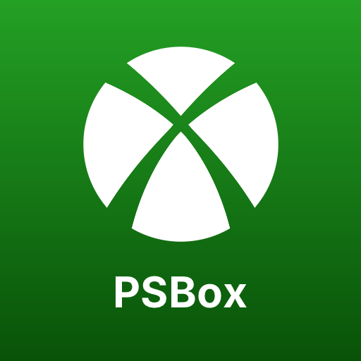

<p align="center">
  
</p>

<h1 align="center">PSBox Cloud Gaming</h1>
<p align="center"><em>Xbox Cloud Gaming, running natively on PlayStation 5.</em></p>

<p align="center">
  <a href="https://github.com/RafaelNGP/xbox-cloud-gaming-ps5/releases/latest"></a>
  <a href="#installation"></a>
  <a href="https://www.xbox.com/xbox-game-pass"></a>
  
  <a href="LICENSE"></a>
  <a href="https://github.com/RafaelNGP/xbox-cloud-gaming-ps5/issues/new?template=bug_report.yml"></a>
</p>

A native Xbox Cloud Gaming (xCloud) client for jailbroken PS5 consoles. Sign in
with your Microsoft account, browse the cloud catalog in a UI modeled on
xbox.com/play, and stream games at 1080p60 with sound, using the DualSense as
an Xbox controller.

- Sign-in with a device code (or QR code) shown on the TV; no password is
  ever typed on the console.
- Home screen with the same rows as xbox.com/play: Jump back in, Recently
  added, Most popular on cloud, Leaving soon and All games.
- WebRTC streaming (libdatachannel on Mbed TLS) with H.264 and Opus decoded by
  FFmpeg on the CPU.
- Settings (Triangle on the home screen): language (English, Português
  (Brasil), Español, Français, Deutsch, Italiano), stream resolution (1080p or
  720p for slower connections) and server region.
- Custom PS5 Home art (selection and launch backgrounds), generated from the
  same code as the icon by `tools/ps5/home-art.sh`.

Requires a homebrew-enabled PS5 that can run directory-style apps (for
example through ShadowMountPlus) and a subscription that includes cloud
gaming.

## Installation

No building needed: download `PPSA99810.zip` from the
[latest release](https://github.com/RafaelNGP/xbox-cloud-gaming-ps5/releases/latest).

1. Extract the zip and copy the `PPSA99810` folder, as a whole, to
   `/data/homebrew/` on the PS5 (for example over FTP).
2. Wait for the loader (e.g. ShadowMountPlus) to add the **PSBox Cloud Gaming**
   icon to the Home screen, then launch it.
3. Sign in: open <https://www.microsoft.com/link> on your phone or computer
   (or scan the QR code) and enter the code shown on the TV.

To update, close the app and copy the new folder over the old one; your
sign-in is kept. The sign-in lives in `PPSA99810/account.json`: never share
that file. More details, controls and troubleshooting are in the
`README.txt` inside the folder.

## Building

Clone with the submodules (Mbed TLS, libdatachannel, FFmpeg):

```bash
git clone --recursive https://github.com/RafaelNGP/xbox-cloud-gaming-ps5.git
cd xbox-cloud-gaming-ps5
```

Requirements: CMake 3.20+, Ninja, Clang/LLVM (clang, clang++, llvm-ar,
llvm-ranlib), Python 3 and curl. NASM is built automatically if missing.
FFmpeg is configured and built by `tools/build-ffmpeg.sh` the first time
CMake runs.

### Desktop build (Linux)

Used to develop and check the protocol and the UI on a PC.

```bash
cmake -S . -B build-host -G Ninja -DCMAKE_BUILD_TYPE=RelWithDebInfo
ninja -C build-host
build-host/xcloud-tests                       # unit tests
build-host/xcloud-cli login                   # sign in
build-host/xcloud-cli stream BALATRO 30       # stream a title for 30 s (--720p, --region=EASTUS)
build-host/xcloud-cli ui-preview /tmp/ui      # render every screen to PNG
```

### PS5 build

The console build uses the toolchain of
[PS5_Vulkan](https://github.com/mihawk-99/PS5_Vulkan) (the PS5 payload SDK, the PS5 linker
recipe and `ps5-native-tool`). By default it is expected at
`../../WoW-PS5/deps/PS5_Vulkan`; set `PS5_VULKAN` to point elsewhere.

```bash
cmake -S . -B build-ps5 -G Ninja -DCMAKE_TOOLCHAIN_FILE=cmake/ps5.toolchain.cmake -DCMAKE_BUILD_TYPE=Release
ninja -C build-ps5 xcloud_app
tools/ps5/link.sh build-ps5          # -> build-ps5/eboot.bin
tools/ps5/package.sh build-ps5       # -> build-ps5/pkg/PPSA99810/
```

## License

GPL-3.0-or-later; see `LICENSE`. The PS5 binary statically links the PS5 app
runtime and payload SDK platform layer, which are GPL-3.0-or-later, so the
project as distributed must be too. All other components are compatible
(Mbed TLS, libdatachannel, FFmpeg under the LGPL, stb, qrcodegen, the Inter
font, Mozilla's CA bundle); `THIRD_PARTY_NOTICES.md` lists each one with its
version and license.

This is an unofficial project, not affiliated with, endorsed or sponsored by
Microsoft or Sony. Xbox, Xbox Cloud Gaming and Game Pass are trademarks of the
Microsoft group of companies; PlayStation and PS5 are trademarks of Sony
Interactive Entertainment. Game names and artwork are loaded from Microsoft's
public catalog at runtime and are not distributed with this project.
Microsoft may change or block the services this client relies on at any time.
